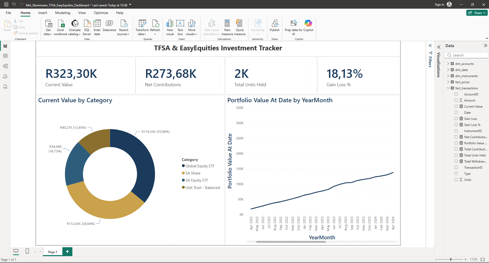

# TFSA & EasyEquities Investment Portfolio Dashboard

A Power BI dashboard tracking a South African investment portfolio (modeled on TFSA and EasyEquities-style investing), built on a synthetic dataset designed to mirror realistic contribution, trading, and pricing patterns.

## Overview

This dashboard answers the core questions any investor asks about their portfolio:

- **How much have I contributed, and how much is it worth now?**
- **What's my overall return?**
- **How is my money spread across different asset types?**
- **How has my portfolio's value evolved over time?**

## Data Model

The project uses a star schema with two fact tables and three dimension tables:

**Fact tables**
- `fact_transactions` — every contribution, withdrawal, buy, sell, and dividend event
- `fact_prices` — monthly price snapshots per instrument

**Dimension tables**
- `dim_date` — calendar table, marked as an official Power BI date table to support time intelligence
- `dim_instruments` — the ETFs, shares, and unit trusts held, with category classification
- `dim_accounts` — account-level metadata

## Key Measures (DAX)

| Measure | What it calculates |
|---|---|
| `Total Contributions` / `Total Withdrawals` | Cash in/out of the portfolio |
| `Net Contributions` | Contributions minus withdrawals |
| `Total Units Held` | Net units held (Buys minus Sells, correctly netted) |
| `Current Value` | Units held × latest known price, summed across all instruments |
| `Gain Loss` / `Gain Loss %` | Portfolio performance vs. money contributed |
| `Portfolio Value At Date` | **Point-in-time portfolio valuation** — reconstructs what the portfolio was worth at any historical date, using only transactions and prices known as of that date |

The `Portfolio Value At Date` measure was the most technically involved part of the project. It uses `SUMX` iterating over instruments, with `CALCULATE` and `ALL(dim_date)` to override the report's date filter and manually reconstruct historical holdings and pricing — rather than relying on Power BI's default "latest value" behavior, which would have been inaccurate for a time-series trend.

## Dashboard Visuals

- **KPI cards** — Current Value, Net Contributions, Total Units Held, Gain Loss %
- **Category allocation** — donut chart showing portfolio diversification across Global Equity ETF, SA Equity ETF, SA Share, and Unit Trust holdings
- **Portfolio value trend** — line chart showing month-by-month portfolio value growth over the tracked period

## Tools Used

- Power BI Desktop (Power Query, DAX, data modeling)
- Custom Power BI theme (navy/gold palette) for a finance-appropriate visual identity

## Files in this repo

- `Mel_Stenemann_TFSA_EasyEquities_Dashboard.pbix` — the full Power BI project file (open in Power BI Desktop to explore interactively)
- `investment_dashboard.pdf` — static export of the dashboard
- `dashboard_screenshot.png` — preview image
- `fact_transactions.csv`, `fact_prices.csv`, `dim_date.csv`, `dim_instruments.csv`, `dim_accounts.csv` — the five source CSV files used to build the model

## Notes

This project uses **synthetic data** generated to reflect realistic South African investment patterns (TFSA contribution limits, EasyEquities-style instrument categories). It does not represent real personal financial information.
